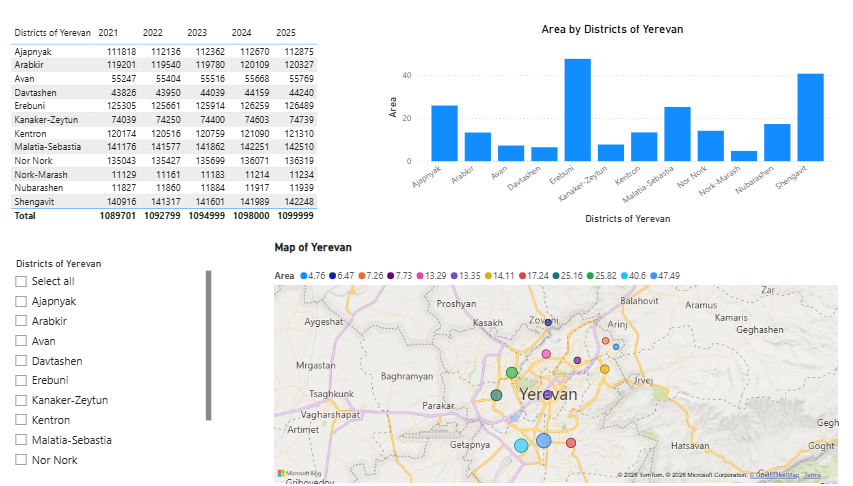
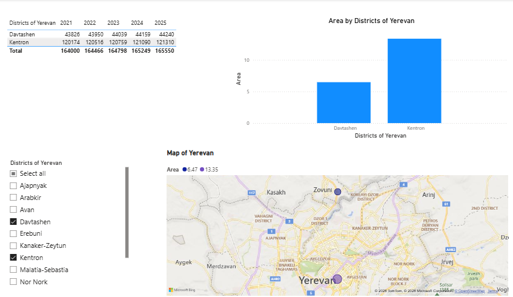
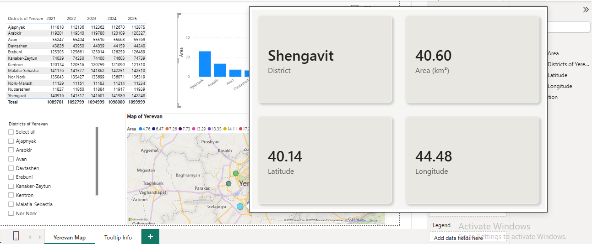

# Districts of Yerevan — Power BI Dashboard

An interactive Power BI report exploring the administrative districts of Yerevan — their location, area, and population growth from 2021 to 2025.

## 📊 Report Overview

The report has **two pages**:

1. **Yerevan Map** — the main dashboard page with a slicer, a table, a column chart, and an interactive map.
2. **Tooltip Info** — a hidden page used purely as a **custom tooltip** for the map (see below).

## 🧩 Visuals Used

| Visual | Type | Fields | Purpose |
|---|---|---|---|
| District Slicer | List slicer (multi-select, "Basic" mode, select-all enabled) | District name | Filters every other visual on the page by one or more districts |
| Population Table | Table | District, Population (2021, 2022, 2023, 2024, 2025) | Shows year-by-year population figures per district |
| Area Column Chart | Clustered column chart | Category: District · Value: Sum of Area | Compares the area (km²) of each district |
| District Map | Map (bubble map) | Category: District · Latitude/Longitude · Size: Area · Series: District | Plots each district geographically, with bubble size scaled to district area |

## 🎛️ Filter

- **District Slicer**: a single list-based slicer on the district name, placed on the main page. It's set to multi-select, so you can select one, several, or all districts at once, and every visual (table, chart, map) updates together.

## 💡 Custom Tooltip

The map visual uses a **custom tooltip page** instead of Power BI's default hover tooltip:

- A second report page, **"Tooltip Info,"** is configured as a **tooltip page** (marked as a tooltip in the page settings, not a regular visible page).
- It contains a **card visual** displaying the district name, its area, and its latitude/longitude.
- The map visual is set to use this page as its tooltip, so hovering over a district bubble on the map shows this custom-styled info card instead of a plain default tooltip.

This gives the map a cleaner, more branded hover experience than Power BI's built-in tooltip.

## 🖼️ Screenshots

**Dashboard overview** — slicer, population table, area chart, and district map together:

**Filtered view** — selecting districts in the slicer updates the table, chart, and map at once:

**Custom tooltip** — hovering over a district bubble on the map shows the custom tooltip page instead of the default hover box:

## 🗂️ Data

The underlying data model contains district-level data on:
- District name and boundaries (Area table): area, latitude, longitude
- Population table: yearly population figures (2021–2025) per district

## 🚀 How to Use

1. Clone/download this repository.
2. Open `Districts_of_Yerevan.pbix` in [Power BI Desktop](https://powerbi.microsoft.com/desktop/).
3. Use the district slicer on the left to filter the table, chart, and map.
4. Hover over any bubble on the map to see the custom tooltip with district details.

## 🛠️ Tech Stack

- Power BI Desktop
- DAX (for aggregated measures: Sum of Area, Sum/Min of Population fields)
- Custom tooltip pages (Power BI native feature)

## 📌 Notes

- Feel free to fork this project and adapt it to other cities or regions.
- Contributions and suggestions are welcome via issues or pull requests.
